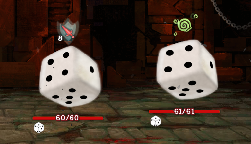
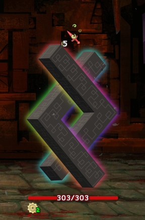

# Conspire mod for Slay the Spire

This mod consolidates most of my small mods for Slay the Spire into one, and adds several new things on top.

The mod adds new monsters, elites and bosses to the game, as well as new cards for the 3 standard classes, and new relics.

## Requirements ##
* Slay the Spire
* ModTheSpire v4.0.0 or newer (https://github.com/t-larson/ModTheSpire/releases)
* BaseMod v3.2.0 or newer (https://github.com/daviscook477/BaseMod/releases)
* Java 8

## Installation ##
1. [Download `ModTheSpire.jar`](https://github.com/kiooeht/ModTheSpire/releases)
2. Move `ModTheSpire.jar` into your **Slay The Spire** directory. This directory is likely to be found under `C:\Program Files (x86)\Steam\steamapps\common\SlayTheSpire`.
3. Create a `mods` folder in your **Slay The Spire** directory
4. [Download `BaseMod.jar`](https://github.com/daviscook477/BaseMod/releases), and place it in the `mods` folder.
5. [Download `Conspire.jar`](https://github.com/twanvl/sts-conspire/releases), and place it in the `mods` folder.
6. Your modded version of **Slay The Spire** can now be launched by double-clicking on `ModTheSpire.jar`
7. This will open a mod select menu where you need to make sure that both `BaseMod` and `Conspire` are checked before clicking **play**
